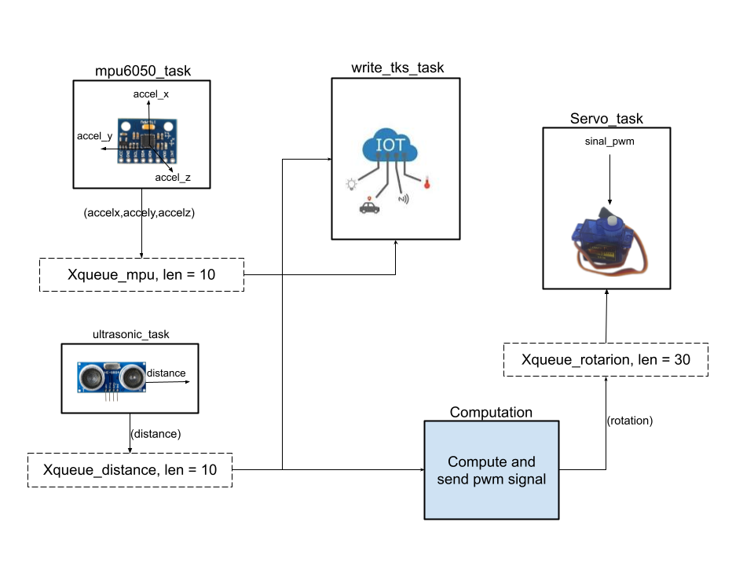

# simple-rtos-navigation
A IoT project to lineal navigation using freertos RTOS. This project was developed  with my computer engineering students at the [FIAP](https://www.fiap.com.br/) university - São Paulo, Brasil.

- [Setup](#setup)
- [Development](#development)
- [Run](#contribution-guide)

## Setup

The hardware used for this project was:
- mpu6050
- ultrasonic sensor
- servo motor
- esp32
The software configuration:
- esp-idf
- thingspeaks platform
- docker & docker-compose
- python3

## Development

The solution architecture:

## Run

You need to flash your esp32:
- build the project
- select the interface and port
- flash the device

Please see the docs section for more details intructions.